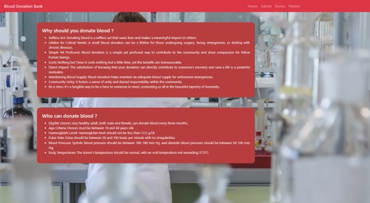

# Blood-Donation-Management
The Blood Donation Management website is a comprehensive online platform designed to streamline the process of blood donation. With a user-friendly interface, the website facilitates efficient communication between blood donors and recipients. Donors can easily register and track their donation history, while recipients can request blood. The website aims to enhance the availability of safe and timely blood donations.

# Outline Of The Project
- Blood group
- Available blood stock
- Donor detail
- Patient detail

# Modules
## Admin
Admin is the main role in the system, admin can manage all the activities like managing donor, patients and blood stock etc.
### Admin can perform
- Check the available stock of the blood
- Manage donors
- Manage patients
- Manage blood donations
- Manage blood requests
- Logout 

## Donors
Donor is also an important role in the system. If any person or donor want to donate the blood, he or she has to register himself first. Once he or she register he/she can login to the system where he can manage or execute donor’s activities like 
### Donors can perform
- Donate blood
- Manage donation history
- Check the status of donation requests
- Logout 

## Patients
Patient is the one who is suffering from any disease and he need blood. He can go to the system and register himself as a patient. Once he registers, he/she can login to the system and access patient dashboard.

### Patients can perform
- Check the available stock of the blood
- Book the blood
- Logout

# System Requirement
### Hardware 
- Processor (CPU)
- Memory (RAM)
- Storage
- Operating System (OS)
- Stable internet connection

# Tools to be used 
- Front End tools: HTML, CSS, JavaScript, BootStrap.
- Back End tools : PHP.
- Database: MariaDB.
- Other tools : VS Code, Xampp, Heidisql.

# Structure
- DFD

- ER Diagram

# Interface (UI)

## Home Page

## Admin Login Page

## Admin Dashboard Page

## Donors Page

## Donor Dashboard

## Donate Blood Page

## Request Blood Page

## Email Notification

